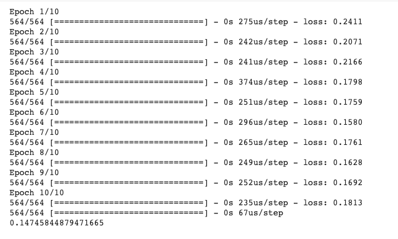

# Time-series-forecasting

**Time Series Forecasting**

  Making predictions about the future is called extrapolation in the classical statistical handling of time series data. More modern fields focus on the topic and refer to it as time series forecasting. Forecasting involves taking models fit on historical data and using them to predict future observations. Descriptive models can borrow for the future (i.e. to smooth or remove noise), they only seek to best describe the data. An important distinction in forecasting is that the future is completely unavailable and must only be estimated from what has already happened.

**Concerns of Forecasting**

  When forecasting, it is important to understand your goal. Use the Socratic method and ask lots of questions to help zoom in on the specifics of your predictive modeling problem. For example:

How much data do you have available and are you able to gather it all together? More data is often more helpful, offering greater opportunity for exploratory data analysis, model testing and tuning, and model fidelity.
What is the time horizon of predictions that is required? Short, medium or long term? Shorter time horizons are often easier to predict with higher confidence.
Can forecasts be updated frequently over time or must they be made once and remain static? Updating forecasts as new information becomes available often results in more accurate predictions.
At what temporal frequency are forecasts required? Often forecasts can be made at a lower or higher frequencies, allowing you to harness down-sampling, and up-sampling of data, which in turn can offer benefits while modeling.

Time series data often requires cleaning, scaling, and even transformation.

**DATASET**

Into the future kaggle dataset. [https://www.kaggle.com/c/into-the-future/data]

**MODEL**

**TRAINING**

**LOSS VISULIZATION**

**PREDICTIONS**

**RMS ERROR**

